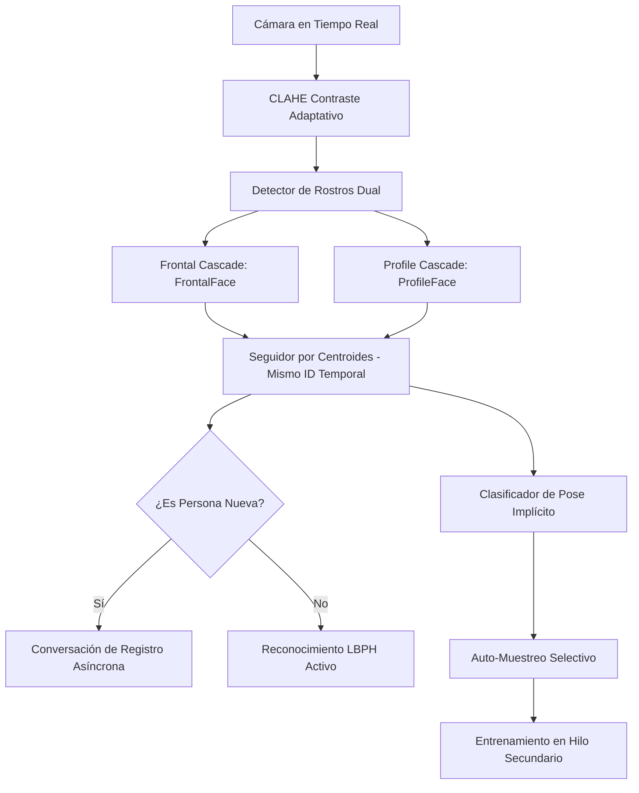

# Plan de Mejora: Visión Artificial con Auto-Entrenamiento Pasivo e Interacción Humana

Este documento define la planificación técnica y de diseño para evolucionar el **Sistema Inteligente de Reconocimiento Facial (S.I.R.F.R.A.)** hacia un asistente de visión autónomo, fluido y conversacional, similar a los agentes de ciencia ficción de la industria.

---

## 1. Visión y Objetivos
1. **Voz Humanizada e Inteligente:** Eliminar frases mecánicas u órdenes directivas (*"mira a la izquierda"*). La IA debe conversar con el usuario usando variaciones lingüísticas y respuestas naturales contextuales.
2. **Auto-Detección de Pose Implícita:** La IA detectará automáticamente si el usuario está mirando de frente o de lado analizando la geometría de la captura en tiempo real.
3. **Seguimiento Temporal de Identidad:** Implementar un seguidor de rostros para saber que la persona que gira la cabeza es la misma que se acaba de registrar, permitiendo capturar sus perfiles sin perder su identidad.
4. **Auto-Entrenamiento Silencioso:** Capturar fotos de nuevos ángulos de forma invisible mientras el usuario se mueve y habla, reentrenando el modelo en segundo plano de forma transparente.

---

## 2. Arquitectura Técnica Propuesta

### A. Módulo Conversacional Natural (Human-Like TTS)
* **Variabilidad de Frases:** Reemplazar las constantes de texto por diccionarios de frases clasificadas por intención (Saludo, Pregunta de nombre, Agradecimiento) seleccionadas al azar.
* **Flujo Alexa:** El asistente inicia con un saludo amigable: *"¡Hola! Qué gusto saludarte, pero no te tengo en mi registro. ¿Me dirías tu nombre?"*
* **Confirmaciones Conversacionales:** En lugar de ordenar movimientos, la IA sostiene una charla ligera mientras realiza el análisis en silencio.

### B. Módulo de Detección de Pose Implícita
Utilizaremos un detector en cascada dual nativo de OpenCV:
1. `haarcascade_frontalface_default.xml` (Rostros de frente).
2. `haarcascade_profileface.xml` (Rostros de perfil lateral).

**Lógica de Clasificación:**
* Si se activa únicamente el detector **Frontal**, la pose es clasificada como **FRENTE**.
* Si se activa el detector de **Perfil** (o hay asimetría ocular severa), la pose es clasificada como **PERFIL**.
* Esto permite al sistema saber en qué dirección mira el usuario sin tener que ordenárselo.

### C. Seguimiento Temporal de Rostros (Centroid Tracker)
Para asegurar que las fotos de perfil se asignan al usuario correcto aunque el reconocedor LBPH lo pierda momentáneamente al girar la cabeza:
* **Algoritmo de Centroides:** Registra la posición $(x, y)$ del rostro en el frame anterior. Si en el frame actual aparece una cara en un radio cercano (por ejemplo, $<50$ píxeles), el sistema asume con un $99\%$ de certeza que es **la misma persona física**.
* **Persistencia:** Al enlazar el rostro detectado a un ID de seguimiento temporal, cualquier perfil capturado (izquierdo o derecho) se guardará automáticamente en la carpeta de la persona que inició el proceso.

### D. Auto-Entrenamiento Pasivo (Passive Self-Training)
* **Mapeo de Poses:** El sistema define tres ranuras de almacenamiento por usuario: `Frente`, `Perfil Izquierdo` y `Perfil Derecho`.
* **Guardado Silencioso:** Mientras conversas con la IA o te mueves, el sistema captura e identifica la pose. Si detecta una pose que aún tiene menos de 5 muestras, guarda el rostro recortado en segundo plano de manera invisible.
* **Actualización Invisible:** Al completar las muestras de un nuevo ángulo, el reconocedor se compila en un hilo paralelo y se recarga en caliente sin alterar la visualización del video.

---

## 3. Comparativa de Flujo de Usuario (UX)

| Flujo Anterior (Robótico) | Flujo Propuesto (Humano e Inteligente) |
| :--- | :--- |
| La IA dice: *"Gira tu cabeza a la izquierda."* | La IA dice: *"¡Qué bien, Carlos! Un gusto conocerte. Déjame configurar unas firmas visuales mientras charlamos."* |
| El usuario debe obedecer y mantener la pose. | El usuario se mueve de forma natural. La IA detecta el giro y captura el perfil automáticamente. |
| El usuario siente que realiza un trámite rígido. | El usuario experimenta una interacción fluida donde la IA aprende de forma implícita. |

---

## 4. Fases de Implementación

### Fase 1: Tracker de Centroides y Detección Profile (Semana 1)
* Integrar el clasificador `haarcascade_profileface.xml`.
* Escribir la lógica de tracking de centroides para asociar rostros en movimiento a un ID único temporal.

### Fase 2: Humanización de Voz y Conversación (Semana 2)
* Crear la base de datos de frases conversacionales.
* Implementar el motor de diálogo asíncrono para gestionar preguntas y respuestas fluidas sin interrumpir el renderizado.

### Fase 3: Auto-Entrenamiento Silencioso (Semana 3)
* Programar el discriminador de poses (Frontal vs. Perfil).
* Implementar el recopilador de muestras automatizado y el reentrenamiento asíncrono en caliente.
